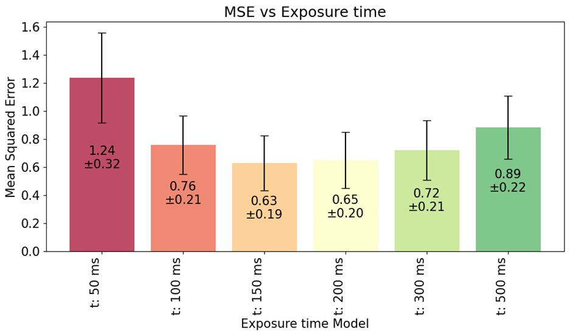
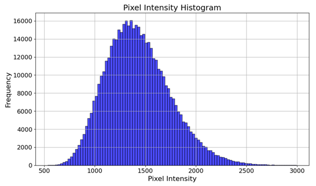

# Semaine 2

## Premiers pas avec un simulateur de données de SMLM

<u>Paramètres principaux</u>
- 128x128 sampled images
- 10 particles
- 30 frames
- D in [0, 1, 2, 3, 4]
- tau in [1, 2, 3, 4, 5] in MSD calculation

<u>Problèmes recontrés</u>

1) Représentation d'une image "continue"  
=> Choix fait : grille à plus haute résolution 1280x1280, sampling réalisé en prenant la valeur max par blocs de 10 pixels

2) Placement des particules sur image continue : les coordonnées des centres (dans 128x128) ont été approximées à un dixième près sur la grille 1280x1280

3) Sampling puis Gaussian smoothing ou l'opposé => pour moi devrait être gaussian smoothing puis sampling

4) Update rule de la position des particules :
- x_c += d*np.cos(theta) # diffusion coeff * random direction (cos)  
- y_c += d*np.sin(theta) # diffusion coeff * random direction (sin)  -> devrait être -sin avec les conventions d'image processing?

---

3 types de D : D_GT, D_{with given coords in 128,128} and D_{from_peaks}.
Clean setup of continuous img.
Turn coords of peak finder.
Start tracking (NN).

# Semaine 3

## Meeting Daniel 03.03

## Meeting Emilien 06.03
### NOTES  
imageJ  
check poisson noise  
check conversion meter pixel  
recreer données réelles : but est d'équiliber  
- histogramme valeurs pixels tot (bruit + 2500-3000 pour particules)
- bruit
  
estimer intensité particules par nb de photons émis dans delta t mais pas ok sur donnees réelles (statiques + intenses, bougent ont moins haute mais répartie)  

dem nouvelles données plus propres  
  
anton unités - facteur 2/4/8 -> demander  
  
exposure time (powerpoint) -> 150ms idéal dans simulations, dem pour acquisition données réelles  
2x peut aider significativement à réduire le bruit  
  
- bruit + banane
  
25 features de 40 de deepSPT (certaines 3D exclues)  
Modèle d'anton a permis que les features soient picked up par le modele sans besoin de les handcraft  
  
clipping + norm du bruit déjà essayé, meilleur  
  
histogramme bruit simulé à comp avec vrai (right skew)  
  
dig params microscopes - trajectories_to_video  
  
brownian motion avec gaussienne random  
  

isotrop imtoch: avoir forme membrane mitoch comme donnée  

### 2 key graphs for improvement

-> higher exposure time: plus de formes de bananes mais moins de bruit, meilleures perfs

-> need to capture exactly this gaussian with right-skew!
Gaussian for shape + Poisson + tail

### MAIL

Salut,

Après la discussion d’aujourd’hui, voici les données de Jose que tu peux  ouvrir avec Fiji/ImageJ.

https://www.swisstransfer.com/d/aaf0b7dd-95ae-41e6-bfbb-d07adab9adeb

Tu dois ouvrir les fichiers qui sont dans le dossier _20240912_HeLa-CV-SUgamma-HTL-TMRms_2_/stack1/frame_0.ets, je ne sais pas trop ce que sont les autres fichiers.

 

Sinon pour la partie simulation, la partie importante de la simulation est dans helpers/helpersGeneration.py la fonction trajectories_to_video et sa sous-fonction trajectory_to_video. Tu peux voir pour t’en inspirer pour ta simualtion et/ou trouver où sont ses défauts.

 

Les modèles sont dans helpers/models.py, le fichier est un peu brouillon mais tu devrais pouvoir extraire que les modèles qui t’intéressent. N’hésite pas à regarder dans les fichiers de Anton pour ses modèles vu qu’ils sont plus avancés que les miens (les siens utilisant frames + trjectoires x,y alors que les miens n’utilisent que frames + trajectory_features)

 

Pour les histoires de baisser le framerate, n’hésite pas à reprendre le plot/le travail dans le folder Experiments/Framerate. Rappel la structure de ces experiments c’est généralement un fichier avec les settings (TrainSettings), un fichier qui entraine les modèles (trainModels), et finalement un notebook qui analyse les trainResults.pth généré par le fichier d’entrainement.

 

En ce qui concerne la connection au cluster, voici les commandes que je faisais :
ssh silly@paperino.epfl.ch

On m’avait créé un login dans le cluster paperino avec mo gaspar. J’imagine que ce sera a peu près la même chose pour toi.

 

Ensuite pour envoyer les fichiers t’as 2 solutions :
1. Les envoyer manuellement avec rsync [fichier_local] [dossier_d’arrivée]

je te laisserai regarder la documentation je retrouve pas la commande exacte

2. te connecter à git sur le cluster, puis faire des git push depuis ton pc quand ton code marche et git pull sur le cluster pour les utiliser.

Ce sera peut-être plus simple mais ça implique de te connecter à git depuis le cluster

Et pour lancer les entrainements sur le cluster d’abord avoir un environnement python avec tout installé (pip install etc)

Puis pour entrainer les modèles faire python ./trainModels.py (dans le bon dossier)

 

Voila bonne chance pour le projet, j’espère que tu arriveras à avancer comme tu veux. Si t’as la moindre question hésite pas à me demander.

 

Emilien

# Semaine 4
Questions auxquelles j'ai du répondre pour le NN tracking:
- saut maximum autorisé entre deux frames
- initialisation des trajectoires => choix d'initialiser une trajectoire par peak repéré sur la première frame de la série (0)
- cas de sorties de l'image => garder que les trajectoires 'actives' encore en train d'être traquées
- une trajectoire = un index + une liste de positions (x,y)
- en suite par frame de 1 à la fin : flatten les peaks de la frame, pour les trajectoires actives : prendre leur dernière position, calculer les distances de tous les peaks actifs à cette position, changer pour l'infini les distances des peaks déjà assignés, trouver le min idx + mean dist, ajouter la position du min dist à la trajectoire, changer son booléen à used
- si aucune distance min n'est trouvée plus petite que la distance max de saut autorisée entre deux frames, la trajectoire s'arrête ici
- comment gérer les trajectoires déjà utilisées : une liste booléenne 'used' de la taille de peaks, à True pdt la recherche si le peak est déjà assigné
- 

---
Add gaussian noise takes img min to 0 -> clip to 100 to mimic background? or ok to take 0  PAS CLIPPER RAJ 100
New version of NN tracking  
Fixed D_detection  
Done labelling from GT with cog
Loclization in progress
+ to do: stacks of 10, graphs for 4D

photo : into HH trakcing (matrice qui sort tableau de correspondance)
remettre sigma unique et amp(sigma) dans gaussienne
bruit : pas clipper à 100 mais faire gaussienne sur 100, expectation du bg sans particules doit rester à 100

Doute sur bruit : 
- gaussienne à std=10, 100 -> aucun effet
- proper noise à partir de environ 2000 => donc valeurs <0
- clipper à 0 ??
---

# Semaine 5  
**Done**
- fixed gaussian fitting: amplitude(sigma)
- tracking v4: with assignment algorithms (cost matrices, 3 algos, assignment of found trajectories to closest GT trajectories)
- cost_cog = distances GT cog vs new_traj cog
- stack experiment: 10 particules, same D, extract the three MAEs
- assignment experiment (bof): to compare performances of the three assignment algos. lacks proper metric (MAEs of D vs D_GT)
- thought of solution for enhanced tracking (trajectories that don't start from frame zero): idea is, new found peak becomes start of new trajectory if unassigned

**To do**
- implement enhanced tracking

---
# Semaine 6
**Done**  
- visualisation entre 0 et 5000, peaks à 1000, gaussian noise mean 100 std 30
- fixed localization plots
- générateur de trajectoires avec début et fin random
  
**In progress**  
- linear visualization of trajectories
- enhanced NN tracking -> pick up trajectoires commençant après frame 0
- start and end cropping: 20% chance, first 30% and last 30%, padding by nans? no second try: refactoring to store start and end frames
- implement 'merge' trajectories : rapiécer (par cogs)
- implement disappearing one one-two frames, then reappearing in simulator
- simple case experiment

**To do**  
- PROPERLY MATCH COGS (FRAME MATCHING)
- enhanced stack experiment -> run ce soir? 
- notes pour la suite
- gap handling

--- 
# Semaine 7
- added **blinking**: keep following motion and make disappear for 1-2 frames, then reappear, better than stopping motion to mimic what's seen on microscopy data.
Added visible attribute to particles, render only visible particles. Also added a certain number of remaining blinking frames (somewhere between 1-2 frames for now).
- by checking real data : je ne vois pas d'autre solution que denoising = capture noise + remove it
- started taking a look at **denoisising techniques**:
    1) Spectral (DL-based): https://pubs.rsc.org/en/content/articlehtml/2024/nr/d3nr05870k
    2) Multistep: 
    - a Voronoi Tessellation-based method ->  to remove free non-polymer localization points 
    - G-means algorithm -> generate a group of clusters with centers. Features of the clusters are counted, which are passed to the LOF and DBSCAN algorithms as parameters.
    - Local Outlier Factor (LOF) -> remove non-polymer localization points near the sample signal area.
    - DBSCAN -> eliminate non-specific localization clusters 

# Post-blek
1) turn cost function into class
